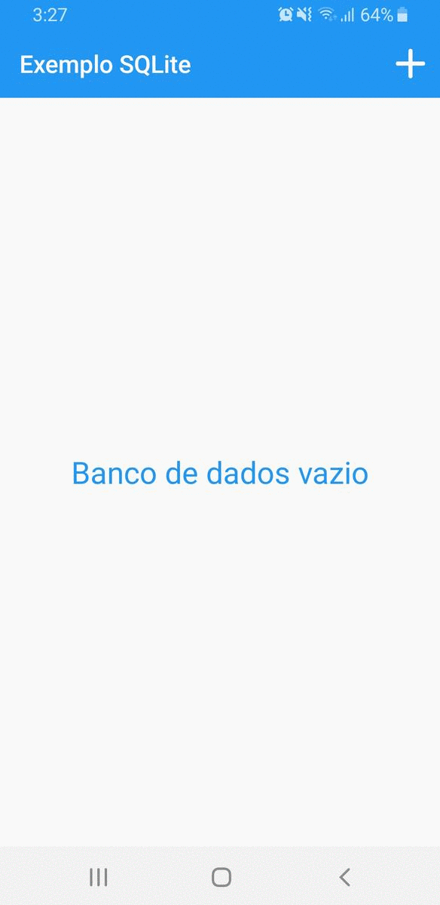

# Exemplo uso SQLite

Um App para Android que salva os dados no banco de dados SQLite. Seu funcionamento é bem simples, ao clicar no ícone de adicionar na Toolbar o usuário é levado a uma Activity para adicionar um título e descrição. Após adicionar os valores nos campos o mesmo é levado para a tela inicial do aplicativo que mostra uma lista dos itens salvos.

### Android Versão Mínima
Android 4.4 (API level 19)

### Recursos

- Verifica se o banco de dados está vazio e exibe uma mensagem na tela caso esteja
- Salva valores no banco de dados SQLite
- Exibe os itens salvos em uma lista (apenas o título)
- Ao dar um longo clique em cima do item é possível visualizar o que há dentro do mesmo (descrição) em um Dialog
- Opção de deletar o item do banco do dados com um longo clique sobre ele
- Tratamento de campos vazios antes de enviar para o banco de dados
 

### Licença
Este repositório está disponível sob a licença [Mozilla Public License, version 2.0](https://github.com/jhonatasrm/exemplo-uso-sqlite/blob/master/LICENSE)
